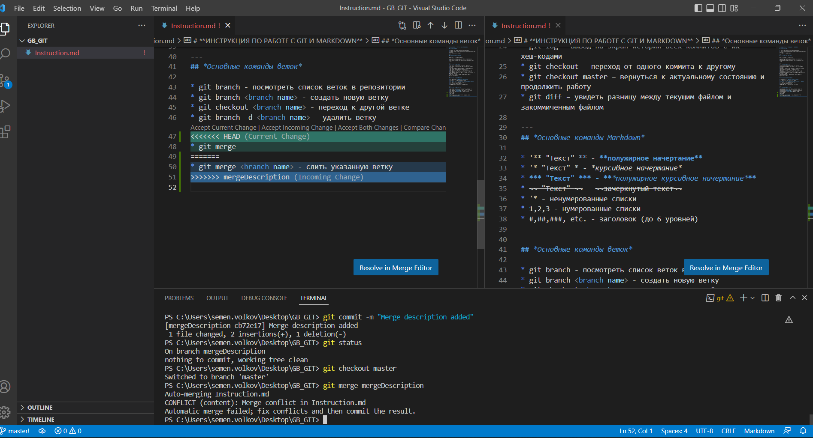

# **ИНСТРУКЦИЯ ПО РАБОТЕ С GIT И MARKDOWN**

## *Установка GIT*

1. Скачать Git (https://git-scm.com/downloads)
2. Скачать Visual Studio Code (https://code.visualstudio.com/Download)
3. Установить обе программы

---
## *Первичная настройка Git*

Задать имя и почту пользователя:

* git config --global user.name «Ваше имя английскими буквами» - Имя пользователя
* git config --global user.email ваша почта@example.com - Почта

---
## *Основные команды Git*

* git init – инициализация локального репозитория
* git status – получить информацию от git о его текущем состоянии
* git add – добавить файл или файлы к следующему коммиту
* git commit -m “message” – создание коммита.
* git log – вывод на экран истории всех коммитов с их хеш-кодами
* git checkout – переход от одного коммита к другому
* git checkout master – вернуться к актуальному состоянию и продолжить работу
* git diff – увидеть разницу между текущим файлом и закоммиченным файлом

---
## *Основные команды Markdown*

* '** "Текст" ** - **полужирное начертание**
* '* "Текст" * - *курсивное начертание*
* *** "Текст" *** - ***полужирное курсивное начертание***
* ~~ "Текст" ~~ - ~~зачеркнутый текст~~
* '* - ненумерованные списки
* 1,2,3 - нумерованные списки
* #,##,###, etc. - заголовок (до 6 уровней)

---
## *Основные команды веток*

* git branch - посмотреть список веток в репозитории
* git branch <branch name> - создать новую ветку
* git checkout <branch name> - переход к другой ветке
* git branch -d <branch name> - удалить ветку с проверкой
* git merge <branch name> - слить указанную ветку

---
## *Скриншот конфликта*

Разрешенный конфликт:

---
# **Работа с удаленными репозиториями**

## *Настройка совместной работы*

1. Создать аккаунт на GitHub.com
2. Создать локальный репозиторий
3. “Подружить” ваш локальный и удалённый репозитории. GitHub при создании нового репозитория подскажет, как это можно сделать
4. Отправить (push) ваш локальный репозиторий в удалённый (на GitHub), при этом, возможно, вам нужно будет авторизоваться на удалённом репозитории
5. Провести изменения “с другого компьютера”
6. Выкачать (pull) актуальное состояние из удалённого репозитория

---
## *Создание pull request*

* Делаем (ответвление) репозитория fork
* Делаем git clone версии репозитория СВОЕЙ
* Создаем новую ветку и в НЕЕ вносим свои изменения
* Фиксируем изменения (делаем коммиты)
* Отправляем свою версию в свой GitHub
* На сайте GitHub нажимаем кнопку pull request
